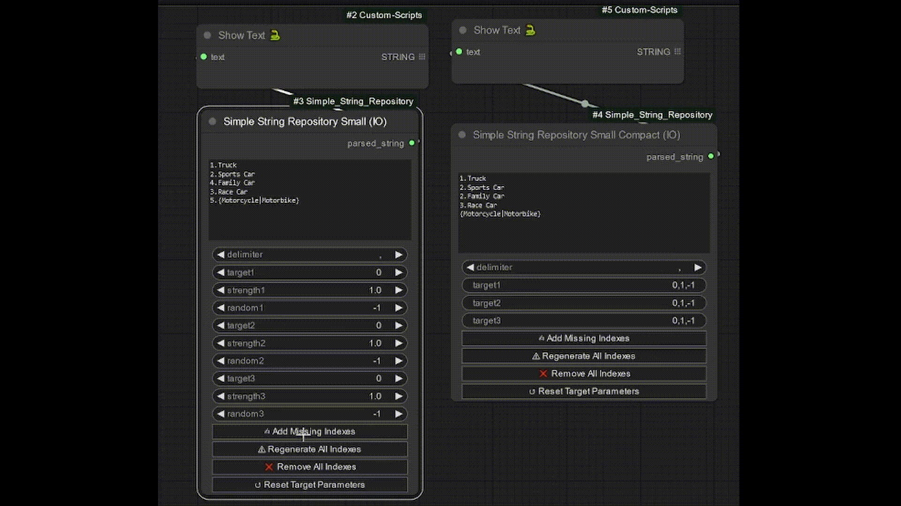
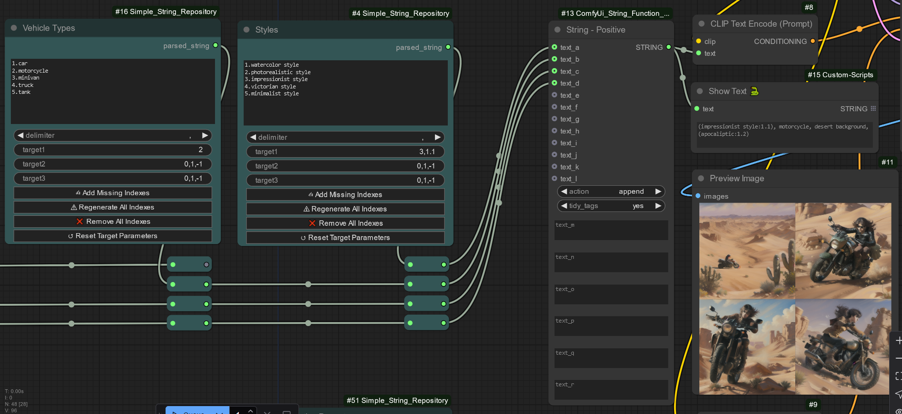
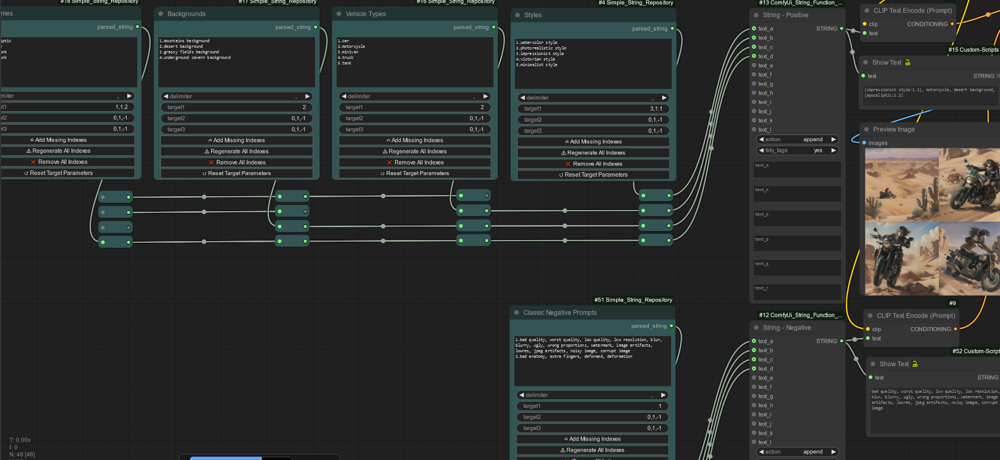

# ComfyUI_Simple_String_Repository

A small utility node (in multiple variations) which assists prompt building by allowing you to use "quick and dirty" collections of strings, separated via new-line and indexed inside the string itself, directly in ComfyUI - as opposed to loading from massive collections of external files.  

The nodes also support basic "randomness" syntax, which is explained in the [sd dynamic prompts repo](https://github.com/adieyal/sd-dynamic-prompts).  

However, unlike the dynamic prompts in the above repo, this node aims at helping you build prompts faster using many small collections of strings already relevant to your specific project / workflow, as opposed to exploring different combinations of random elements from massive lists.  
This is better illustrated below.


Install
-----------------------------------------------------------------------------

**Option 1**

Install via [ComfyUI-Manager](https://github.com/ltdrdata/ComfyUI-Manager) - [ComfyUI Registry Page](https://registry.comfy.org/publishers/io/nodes/comfyui_simple_string_repository).

**Option 2**

Clone the repository into your ComfyUI custom_nodes directory.
```text
git clone https://github.com/IgalOgonov/ComfyUI_Simple_String_Repository
```

The Node(s)
-----------------------------------------------------------------------------  

The nodes are all called "Simple String Repository".  
The there are three **variations** based on the number of potentially selected strings (`Small` for 3, no suffix for 5, and `Large` for 10), and each node has a "compact" version which is worse for automated workflow but more comfortable if you intend to set all selection parameters (1 required, 2 optional) manually.  



Each node has the `string` input, which corresponds to the collection of strings you wish to use.  
By design, each collection should represent alternative tags belonging to the same "group", e.g. art styles, type of atmosphere, color scheme, artist, etc.  

Below is the `delimiter`, used to separate multiple outputs in case you select more than one strings from the collection.

Afterwards is where the `Compact` and `Regular` nodes differ.  
In regular node, each `target` (the index of the sub-string you wish to select) has three relevant widgets:  
* The index itself (`target`) 
* Its strength (`strength`)
* In case of a collection of randomly interchangeable strings, as explained in the [sd dynamic prompts repo](https://github.com/adieyal/sd-dynamic-prompts), you may explicitly select one of the options via `random` (index starts at 0), or leave it at `-1` for a random output.

The `Compact` nodes simply shove all three parameters into a single `,`-separated string. All optional parameters can be omitted.  

The **indexes** are highly **recommended**, but **optional**.  
Any string that does not have an index will get assigned its line number as an index during runtime.  
When duplicate indexes exist (typically, this would only happen because of a mess caused by mixing indexed and unindexed strings), only the first one can be selected.  
The **front-end functionality** helps avoid that:  

1. `Add Missing Indexes` - This button will add unique numerical indexes to any strings missing them. Will also fix duplicates, but replacing any duplicate identifier with a new one.  
   The new indexes are always the lowest available unique index.  
   Good for when you already have specific automated workflows reliant on specific numbers, but overall, this is considered a quick and dirty fix.
2. `Regenerate All Indexes` - Strips all strings from their existing indexes, then assigns new ones, based on the line number.
3. `Remove All Indexes` - Strips all strings from their indexes.  
4. `Reset Target Parameters` Resets the selection parameters, making the output blank.

Intended Usage
-----------------------------------------------------------------------------  


Those nodes don't really have much functionality by themselves - they are meant to supplement existing prompt builder nodes, such as [String Function Tree](https://github.com/wolfden/ComfyUi_String_Function_Tree), that are meant for prompt building (as opposed to prompt generation / random exploration).  

The collections themselves can be created manually (e.g. explore articles about art styles relevant to your project, and copy-paste relevant styles into an "Art Styles" node), or you can take subsets from existing collections [like the ones over here](https://github.com/adieyal/sd-dynamic-prompts/tree/main/collections).  
As you may have noticed from the earlier preview, the node does support the basic randomness syntax (e.g. `{something|like|this}`), although it's not optimized for it.

  

Note that you don't have to use short strings - you may also use large collections as a single string, as long as you're fine with giving up precision for such strings.
